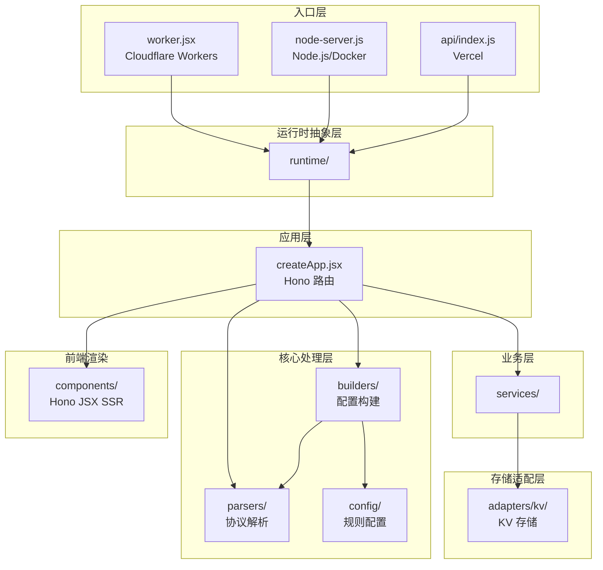
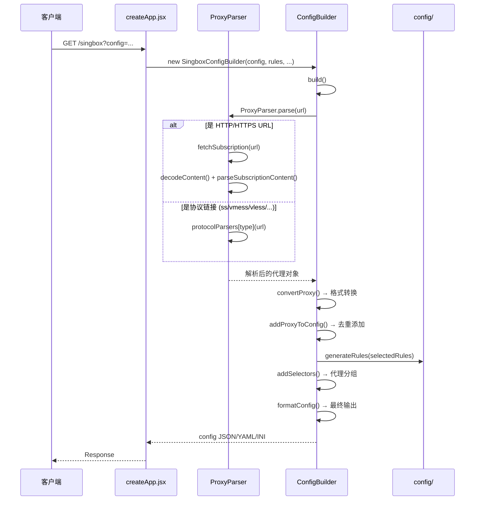
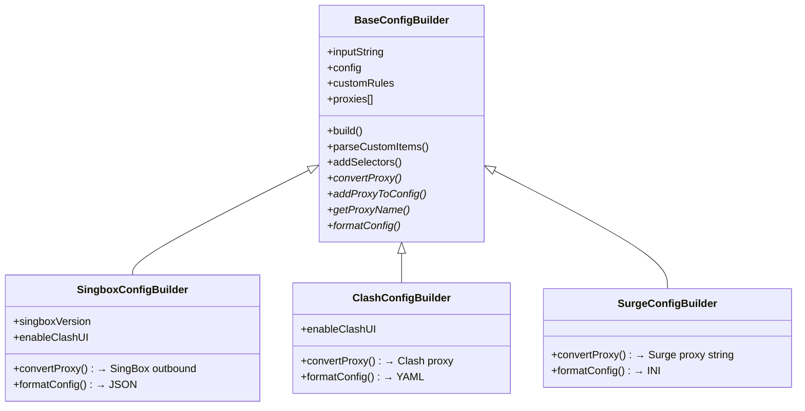

# Sublink Worker 开发指导文档

> 项目版本：v2.3.2 | 仓库来源：`zhusang/sublink-worker` (fork of `7Sageer/sublink-worker`)

---

## 1. 项目概述

**Sublink Worker** 是一个轻量级的的代理订阅链接转换和管理工具，核心功能是把各种代理协议的分享链接/订阅源转换为 **Sing-Box**、**Clash**、**Surge**、**Xray** 等客户端可用的配置文件。

### 核心能力

| 功能 | 说明 |
|---|---|
| 协议解析 | ShadowSocks、VMess、VLESS、Hysteria2、Trojan、TUIC |
| 配置生成 | Sing-Box JSON、Clash YAML、Surge INI、Xray Base64 |
| 输入支持 | Base64 订阅、HTTP/HTTPS 订阅、完整配置（Sing-Box/Clash/Surge） |
| 短链接 | 基于 KV 存储的固定/随机短链接 |
| 多语言 | 中文(zh-CN)、英文(en-US)、波斯语(fa)、俄语(ru) |
| 多平台部署 | Cloudflare Workers、Vercel、Node.js、Docker |

---

## 2. 技术栈

| 技术 | 用途 |
|---|---|
| **Hono** (`^4.10.7`) | Web 框架，统一处理路由和请求 |
| **Hono JSX** | 服务端 HTML 渲染（非 React，使用 `hono/jsx`） |
| **js-yaml** (`^4.1.1`) | YAML 解析/序列化（Clash 配置） |
| **ioredis** (`^5.8.2`) | Redis 客户端（Node.js/Docker 部署时使用） |
| **esbuild** | 构建打包（Vercel 和 Node.js 产物） |
| **wrangler** (`^4.51.0`) | Cloudflare Workers 开发/部署工具 |
| **vitest** (`^3.2.4`) | 测试框架（配合 `@cloudflare/vitest-pool-workers`） |

> [!IMPORTANT]
> 项目使用 **ESM**（`"type": "module"`）。所有 `import/export` 均为 ES Module 语法。

---

## 3. 项目结构

```
sublink-worker/
├── api/                          # Vercel Serverless 入口
│   └── index.js                  # Vercel handler，将 Node.js HTTP 转为 Fetch API
├── public/                       # 静态资源 (favicon)
├── scripts/
│   ├── build-vercel.mjs          # Vercel 构建脚本 (esbuild)
│   └── setup-kv.cjs              # Cloudflare KV 命名空间初始化
├── src/
│   ├── worker.jsx                # ★ Cloudflare Workers 入口
│   ├── app/
│   │   └── createApp.jsx         # ★★★ 核心：Hono 应用 + 所有路由定义
│   ├── adapters/
│   │   ├── assets/
│   │   │   └── fileAssetFetcher.js   # 文件系统静态资源服务
│   │   └── kv/
│   │       ├── cloudflareKv.js       # Cloudflare KV 适配器
│   │       ├── redisKv.js            # Redis KV 适配器
│   │       ├── memoryKv.js           # 内存 KV 适配器（开发/降级用）
│   │       └── upstashKv.js          # Upstash REST KV 适配器
│   ├── builders/                 # ★★ 配置构建器
│   │   ├── BaseConfigBuilder.js      # 抽象基类
│   │   ├── SingboxConfigBuilder.js   # Sing-Box JSON 配置
│   │   ├── ClashConfigBuilder.js     # Clash YAML 配置
│   │   ├── SurgeConfigBuilder.js     # Surge INI 配置
│   │   └── helpers/
│   │       ├── clashConfigUtils.js   # Clash 专用工具
│   │       ├── groupBuilder.js       # 代理分组构建
│   │       ├── groupNameUtils.js     # 分组名称规范化
│   │       └── proxyHelpers.js       # 代理去重辅助
│   ├── components/               # ★ Hono JSX 前端组件（SSR）
│   │   ├── Layout.jsx                # HTML 布局（head/body/CSS/JS）
│   │   ├── Navbar.jsx                # 导航栏
│   │   ├── Form.jsx                  # 主表单 UI
│   │   ├── formLogic.js              # 表单交互逻辑（客户端 JS）
│   │   ├── CustomRules.jsx           # 自定义规则编辑器
│   │   ├── SubscribeLinks.jsx        # 订阅链接展示
│   │   ├── Footer.jsx                # 页脚
│   │   ├── UpdateChecker.jsx         # 版本更新检查
│   │   ├── TextareaWithActions.jsx   # 带操作按钮的文本区域
│   │   └── ValidatedTextarea.jsx     # 带校验的文本区域
│   ├── config/                   # 规则和默认配置
│   │   ├── index.js                  # 配置模块统一导出
│   │   ├── rules.js                  # 统一规则定义 + 预设规则集
│   │   ├── ruleUrls.js               # 规则集 URL 基地址
│   │   ├── ruleGenerators.js         # 规则生成逻辑
│   │   ├── singboxConfig.js          # Sing-Box 默认基础配置
│   │   ├── clashConfig.js            # Clash 默认基础配置
│   │   ├── surgeConfig.js            # Surge 默认基础配置
│   │   └── subconverterConfig.js     # Subconverter 外部配置生成
│   ├── constants.js              # 应用常量
│   ├── i18n/
│   │   └── index.js                  # 国际化翻译
│   ├── parsers/                  # ★★ 协议解析器
│   │   ├── ProxyParser.js            # 解析器调度入口
│   │   ├── index.js                  # 导出
│   │   ├── protocols/
│   │   │   ├── shadowsocksParser.js
│   │   │   ├── vmessParser.js
│   │   │   ├── vlessParser.js
│   │   │   ├── hysteria2Parser.js
│   │   │   ├── trojanParser.js
│   │   │   └── tuicParser.js
│   │   ├── subscription/
│   │   │   ├── httpSubscriptionFetcher.js  # HTTP 订阅源拉取
│   │   │   └── subscriptionContentParser.js # 订阅内容解析
│   │   ├── convertSurgeProxyToObject.js    # Surge 代理格式转换
│   │   └── convertYamlProxyToObject.js     # Clash YAML 代理转换
│   ├── platforms/                # 平台入口
│   │   ├── node-server.js            # Node.js 启动入口
│   │   └── nodeHttpServer.js         # Node.js HTTP 服务器封装
│   ├── runtime/                  # ★ 运行时抽象层
│   │   ├── runtimeConfig.js          # 运行时配置规范化
│   │   ├── cloudflare.js             # Cloudflare 运行时工厂
│   │   ├── node.js                   # Node.js 运行时工厂
│   │   └── vercel.js                 # Vercel 运行时工厂
│   ├── services/                 # 业务服务层
│   │   ├── shortLinkService.js       # 短链接服务
│   │   ├── configStorageService.js   # 配置存储服务
│   │   └── errors.js                 # 自定义错误类
│   ├── utils/                    # 工具模块
│   └── utils.js                  # 通用工具函数
├── test/                         # 测试文件（21 个）
├── Dockerfile                    # Docker 构建
├── docker-compose.yml            # Docker Compose（含 Redis）
├── wrangler.toml                 # Cloudflare Workers 配置
├── vercel.json                   # Vercel 配置
├── vitest.config.js              # Vitest 配置
└── package.json
```

---

## 4. 架构设计

### 4.1 整体架构



### 4.2 运行时抽象模式

项目通过 **运行时工厂模式** 屏蔽不同部署平台的差异。每个平台提供统一的 `RuntimeBindings` 对象：

```javascript
// RuntimeBindings 接口
{
    kv: KeyValueStore | null,       // KV 存储（get/put/delete）
    assetFetcher: Function | null,  // 静态资源服务
    logger: Console,                // 日志
    config: {
        configTtlSeconds: number,       // 配置存储 TTL
        shortLinkTtlSeconds: number     // 短链接 TTL
    }
}
```

| 平台 | KV 实现 | 资产服务 |
|---|---|---|
| Cloudflare | `CloudflareKVAdapter` (Workers KV) | `env.ASSETS.fetch()` |
| Node.js/Docker | `RedisKVAdapter` / `MemoryKVAdapter` | `fileAssetFetcher` (fs) |
| Vercel | `UpstashKVAdapter` / `RedisKVAdapter` | `fileAssetFetcher` |

### 4.3 KV 存储统一接口

所有 KV 适配器实现相同接口：

```javascript
class KVAdapter {
    async get(key): string | null
    async put(key, value, options?: { expirationTtl?: number }): void
    async delete(key): void
}
```

---

## 5. 核心数据流

### 5.1 订阅转换流程



### 5.2 Builder 继承体系



---

## 6. API 路由

| 方法 | 路径 | 功能 | 关键参数 |
|---|---|---|---|
| GET | `/` | Web UI 主页面 | `lang` |
| GET | `/singbox` | 生成 Sing-Box 配置 | `config`, `selectedRules`, `customRules`, `ua`, `group_by_country`, `singbox_version`, `configId` |
| GET | `/clash` | 生成 Clash 配置 | 同上（无 singbox_version） |
| GET | `/surge` | 生成 Surge 配置 | 同上（无 enable_clash_ui） |
| GET | `/xray` | 生成 Xray Base64 | `config`, `ua` |
| GET | `/subconverter` | 生成 Subconverter 外部配置 | `selectedRules`, `customRules` |
| GET | `/shorten-v2` | 创建短链接 | `url`, `shortCode` |
| GET | `/b/:code` | 短链接重定向 → singbox | |
| GET | `/c/:code` | 短链接重定向 → clash | |
| GET | `/x/:code` | 短链接重定向 → xray | |
| GET | `/s/:code` | 短链接重定向 → surge | |
| POST | `/config` | 保存自定义基础配置 | Body: `{ type, content }` |
| GET | `/resolve` | 解析短链接 | `url` |

---

## 7. 关键设计模式

### 7.1 协议解析器注册表

`ProxyParser` 使用**协议前缀映射**模式，新增协议只需：
1. 在 `src/parsers/protocols/` 创建解析函数
2. 在 `ProxyParser.js` 的 `protocolParsers` 对象中注册

```javascript
const protocolParsers = {
    ss: parseShadowsocks,
    vmess: parseVmess,
    vless: parseVless,
    hysteria: parseHysteria2,
    hysteria2: parseHysteria2,
    hy2: parseHysteria2,
    http: fetchSubscription,
    https: fetchSubscription,
    trojan: parseTrojan,
    tuic: parseTuic
};
```

### 7.2 规则系统

规则定义在 `src/config/rules.js` 中使用统一结构：

```javascript
{
    name: 'Google',           // 规则名称（也是出站组名称）
    site_rules: ['google'],   // 站点规则列表
    ip_rules: ['google']      // IP 规则列表
}
```

预设规则集：
- **minimal**: `Location:CN`, `Private`, `Non-China`
- **balanced**: 在 minimal 基础上 + Github, Google, Youtube, AI Services, Telegram
- **comprehensive**: 所有 UNIFIED_RULES

### 7.3 前端渲染模式

项目使用 **Hono JSX** 进行 **服务端渲染（SSR）**。前端交互逻辑直接内联于 JSX 组件的 `<script>` 标签中（参见 `formLogic.js`、`Form.jsx` 等），**不使用任何前端框架**。

> [!WARNING]
> 修改文件头部的 JSX pragma 注释是必须的：
> ```jsx
> /** @jsxRuntime automatic */
> /** @jsxImportSource hono/jsx */
> ```

### 7.4 错误处理

自定义错误继承层次：

```
ServiceError (status: 500)
├── MissingDependencyError (status: 501)
└── InvalidPayloadError (status: 400)
```

`handleError()` 函数统一处理：`ServiceError` 返回对应 HTTP 状态码，其他错误返回 500。

---

## 8. 开发命令

| 命令 | 说明 |
|---|---|
| `npm run dev` | 启动 Cloudflare Workers 本地开发（`wrangler dev`） |
| `npm run dev:node` | 构建并启动 Node.js 版本 |
| `npm test` | 运行测试（Vitest） |
| `npm run build` | Vercel 构建 |
| `npm run build:node` | Node.js 产出构建 |
| `npm run deploy` | 部署到 Cloudflare Workers |

---

## 9. 部署配置

### 9.1 Cloudflare Workers

- 入口：`src/worker.jsx`
- KV 绑定：`SUBLINK_KV`（在 `wrangler.toml` 中配置）
- 静态资源：`public/` 目录通过 `[assets]` 配置

### 9.2 Docker / Node.js

- 入口：`src/platforms/node-server.js` → 编译为 `dist/node-server.cjs`
- 端口：`8787`（可通过环境变量 `PORT` 覆盖）
- 环境变量：

| 变量 | 说明 | 示例 |
|---|---|---|
| `REDIS_HOST` | Redis 地址 | `redis` |
| `REDIS_PORT` | Redis 端口 | `6379` |
| `REDIS_URL` | Redis 完整 URL（优先于 HOST+PORT） | `redis://...` |
| `REDIS_KEY_PREFIX` | Key 前缀 | `sublink` |
| `REDIS_PASSWORD` | Redis 密码 | |
| `REDIS_TLS` | 启用 TLS | `true` |
| `CONFIG_TTL_SECONDS` | 配置存储 TTL | `2592000` (30天) |
| `SHORT_LINK_TTL_SECONDS` | 短链接 TTL | |
| `DISABLE_MEMORY_KV` | 禁用内存 KV 回退 | `true` |
| `STATIC_DIR` | 静态资源目录 | `public` |

### 9.3 Vercel

- 入口：`api/index.js`
- 所有请求重写到 `/api/index`
- 需配置环境变量 `KV_REST_API_URL` 和 `KV_REST_API_TOKEN`

---

## 10. 测试

测试文件位于 `test/` 目录，使用 **Vitest** + `@cloudflare/vitest-pool-workers`。

主要测试覆盖：
- Builder 输出正确性（Clash、Sing-Box、Surge）
- 协议解析器（VMess、SS 插件等）
- 代理分组逻辑（按国家分组、代理组覆盖）
- 短链接/API 端点
- 边缘情况（UDP 处理、MRS 格式、SRC-IP-CIDR 等）

---

## 11. 开发注意事项

> [!TIP]
> ### 新增协议支持
> 1. 在 `src/parsers/protocols/` 创建 `xxxParser.js`
> 2. 导出 `parseXxx(url, userAgent)` 函数，返回标准化的代理对象
> 3. 在 `src/parsers/ProxyParser.js` 的 `protocolParsers` 中注册
> 4. 在三个 Builder 的 `convertProxy()` 方法中添加转换逻辑

> [!TIP]
> ### 新增规则
> 1. 在 `src/config/rules.js` 的 `UNIFIED_RULES` 中添加条目
> 2. 在 `src/i18n/index.js` 的 `outboundNames` 中添加翻译
> 3. 如需加入预设，修改 `PREDEFINED_RULE_SETS`

> [!TIP]
> ### 新增 KV 存储后端
> 1. 在 `src/adapters/kv/` 创建适配器类
> 2. 实现 `get(key)`, `put(key, value, options)`, `delete(key)` 三个方法
> 3. 在对应的 `runtime/` 工厂函数中使用

> [!WARNING]
> ### JSX 相关
> - 所有 `.jsx` 文件必须包含 Hono JSX pragma
> - 组件返回的 HTML 中使用 `class` 而非 `className`（Hono JSX 特性）
> - 前端交互通过内联 `<script>` 实现，不是 React 组件

> [!CAUTION]
> ### 构建产物
> - `npm run build:node` 使用 esbuild 将所有源码打包为单个 CJS 文件 `dist/node-server.cjs`
> - `npm run build` 用于 Vercel，输出到 `dist/vercel/createApp.js`
> - Cloudflare Workers 不需要预构建，wrangler 自动处理

---

## 12. 关键文件速查表

| 场景 | 文件 |
|---|---|
| 添加/修改路由 | `src/app/createApp.jsx` |
| 修改页面 UI | `src/components/Form.jsx`, `Layout.jsx` |
| 修改前端交互 | `src/components/formLogic.js` |
| 添加/修改协议解析 | `src/parsers/protocols/` |
| 修改配置生成逻辑 | `src/builders/` |
| 修改规则 | `src/config/rules.js` |
| 修改默认配置 | `src/config/singboxConfig.js`, `clashConfig.js`, `surgeConfig.js` |
| 添加翻译 | `src/i18n/index.js` |
| 修改应用常量 | `src/constants.js` |
| 添加 KV 后端 | `src/adapters/kv/` |
| 修改平台适配 | `src/runtime/` |
| 修改 Docker 配置 | `Dockerfile`, `docker-compose.yml` |
| 修改 CF Workers 配置 | `wrangler.toml` |
